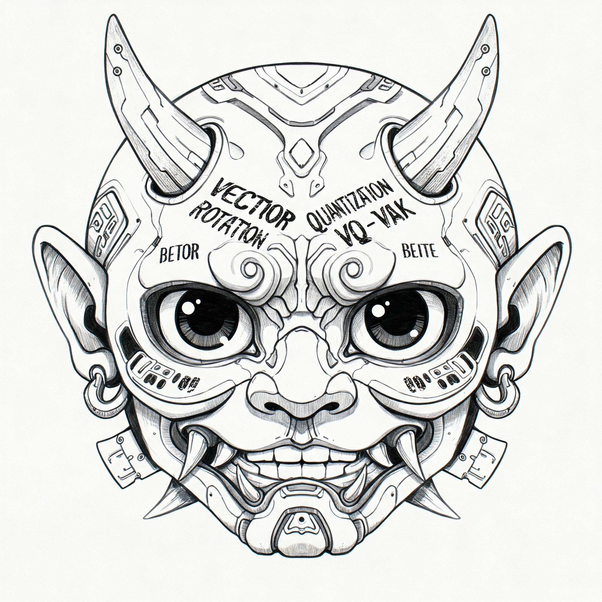

# Restructuring Vector Quantization with the Rotation Trick

1. **October 9, 2024:** Initial release.
2. **March 22, 2025:** Release VQGAN and ViT-VQGAN config files and checkpoints. Also release pretrained model checkpoints for this repository (used to populate Table 1).

This repository contains the official code for Restructuring Vector Quantization with the Rotation Trick. 

For new applications, we recommend lucidrains' excellent [vector-quantize library](https://github.com/lucidrains/vector-quantize-pytorch). This VQ library is highly optimized, available as a python package, and uses the rotation trick to propagate gradients through the VQ layer by default in the VectorQuantize class.



**Restructuring Vector Quantization with the Rotation Trick**  
Christopher Fifty, Ronald G. Junkins, Dennis Duan, Aniketh Iyengar, Jerry W. Liu, \
Ehsan Amid, Sebastian Thrun, Christopher Ré\
ICLR 2025, Oral Presentation\
[arXiv](https://arxiv.org/abs/2410.06424), [OpenReview](https://openreview.net/forum?id=GMwRl2e9Y1)

## Approach

In the context of VQ-VAEs, the rotation trick smoothly transforms each encoder output into its corresponding codebook
vector via a rotation and rescaling linear transformation that is treated as a constant during backpropagation. As a
result, the relative magnitude and angle between encoder output and codebook vector becomes encoded into the gradient as
it propagates through the vector quantization layer and back to the encoder.


## Code environment

This code requires Pytorch 2.3.1 or higher with cuda support. It has been tested on Ubuntu 22.04.4 LTS and python 3.8.5.

You can create a conda environment with the correct dependencies using the following command lines:

```
cd rotation_trick
conda env create -f environment.yml
conda activate rotation_trick
```

## Setup

The directory structure for this project should look like:

```
Outer_Directory
│
│───rotation_trick/
│   │   src/
│   │   ...
│
│───imagenet/
│   │   train/
│   │   │   n03000134/
│   │   |   ...
│   │   val/
│   │   │   n03000247/
│   │   |   ...
```

## Training a Model

Follow the commands in ```src/scripts.sh```.

## Evaluating a Model

See ```src/reconstruction_fid.py``` as well as ```src/reconstruction_is.py``` to generate r-FID and r-IS scores
respectively from a pretrained model.

## Pretrained Model Checkpoints [Table 1]

We release the rotation trick and vqvae model checkpoints that correspond to the results presented in Table 1 via [this download link](https://drive.google.com/drive/folders/1EOg0BTXSoFadG3JYom5j-Cj6n3RxnENo?usp=sharing).

## VQGAN Results [Table 3]

The VQGAN results reported in Table 3 use the [latent diffusion codebase](https://github.com/CompVis/latent-diffusion). We
provide three artifacts to reproduce our findings:

1. ```exp_weights_and_configs/table_3``` contains a configuration .yaml file for both 32x32x3 and 64x64x3 latent shape
   models.
2. ```exp_weights_and_configs/table_3``` contains a ```rot_vqgan.py``` that demonstrates how the rotation trick can be
   integrated into
   the [latent diffusion VQGAN](https://github.com/CompVis/latent-diffusion/blob/a506df5756472e2ebaf9078affdde2c4f1502cd4/ldm/models/autoencoder.py#L14)
   .
3. A [Download Link](https://drive.google.com/drive/folders/180XSS8_hHJtZGJJ3JPMaiLTiYkTv4V9x?usp=sharing) for the model checkpoints used to populate the Table 3 results.

For your convenience, the following command can be used to kick off a VQGAN training run from
the [latent diffusion codebase](https://github.com/CompVis/latent-diffusion).

```commandline
CUDA_VISIBLE_DEVICES=0 python main.py --base path_to_config/config.yaml -t --gpus 0,
```

## ViT-VQGAN Results [Table 4]
The ViT-VQGAN results reported in Table 4 use the [enhancing-transformers](https://github.com/thuanz123/enhancing-transformers) github. We
provide three artifacts to reproduce our findings:

1. ```exp_weights_and_configs/table_4``` contains a configuration .yaml file for the vit-vqgan small model.
2. ```exp_weights_and_configs/table_4``` contains a ```rot_vitvqgan.py``` that demonstrates how the rotation trick can be
   integrated into the [enhancing transformers ViT-VQGAN](https://github.com/thuanz123/enhancing-transformers/blob/1778fc497ea11ed2cef134404f99d4d6b921cda9/enhancing/modules/stage1/vitvqgan.py#L25)
   .
3. A [Download Link](https://drive.google.com/drive/folders/180XSS8_hHJtZGJJ3JPMaiLTiYkTv4V9x?usp=sharing) for the model checkpoint used to populate the Table 4 results.

For your convenience, the following command can be used to kick off a ViT-VQGAN training run from
the [enhancing transformers codebase](https://github.com/thuanz123/enhancing-transformers).

```commandline
CUDA_VISIBLE_DEVICES=0,1 python3 main.py -c config_file -lr 1e-4 -e 100 -ng 2
```

## Citation

```bibtex
@article{Fifty2024Restructuring,
    title   = {Restructuring Vector Quantization with the Rotation Trick},
    author  = {Christopher Fifty, Ronald G. Junkins, Dennis Duan, Aniketh Iyengar, Jerry W. Liu, Ehsan Amid, Sebastian Thrun, Christopher Ré},
    journal = {ArXiv},
    year    = {2024},
    volume  = {abs/2410.06424},
    url     = {https://api.semanticscholar.org/CorpusID:273229218}
}
```